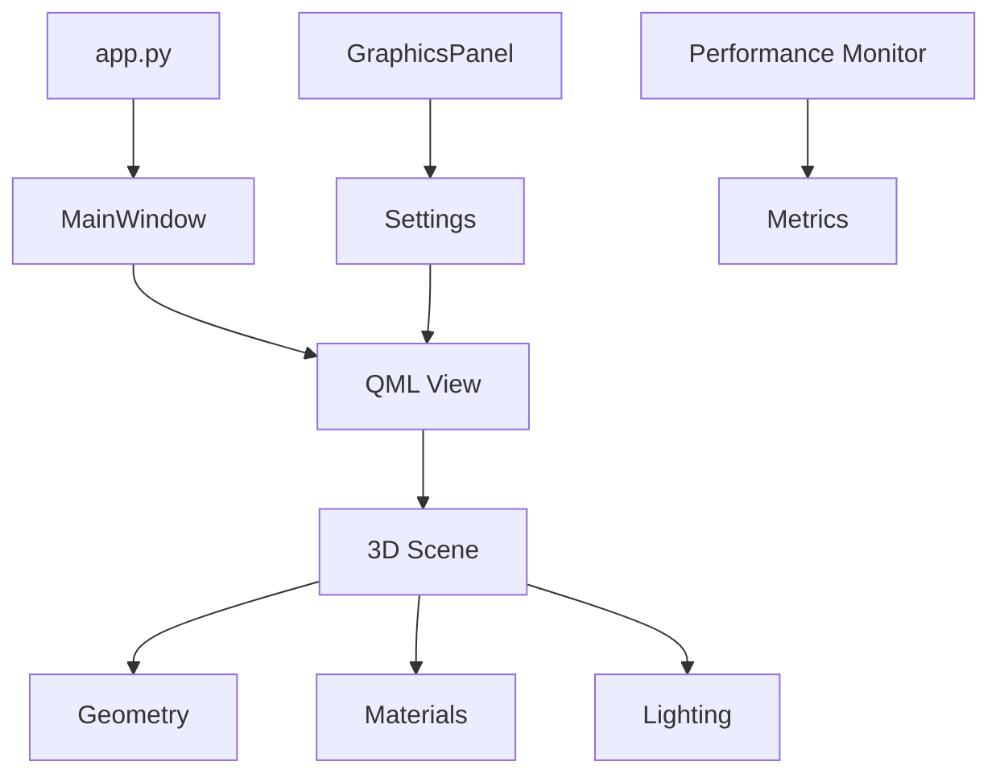

# 🛠️ PneumoStabSim - Резервная конфигурация

## 📦 Версии пакетов (протестировано)

```txt
# Основные зависимости (РАБОТАЮТ)
PySide6==6.10.0
PySide6-Essentials==6.10.0  
PySide6-Addons==6.10.0
shiboken6==6.10.0

# Научные библиотеки
numpy>=1.21.0,<3.0.0
scipy>=1.7.0,<2.0.0
matplotlib>=3.5.0

# Дополнительные
pillow>=9.0.0
PyYAML>=6.0
pytest>=6.0.0
```

## 🎮 Параметры запуска (сохраненные)

### Производительность
```python
# app.py - оптимальные настройки
USE_QML_3D_SCHEMA = True
QSG_RHI_BACKEND = "d3d11"  # Windows
QSG_INFO = "1"
QT_AUTO_SCREEN_SCALE_FACTOR = "1"
```

### Качество графики
```python
# Сохраненные настройки качества
quality_settings = {
    "preset": "ultra",
    "render_scale": 1.05,
    "frame_rate_limit": 144.0,
    "shadows": {"resolution": "4096", "filter": 32},
    "antialiasing": {"primary": "ssaa", "post": "taa"}
}
```

### Материалы
```python
# Оптимальные материалы (сохранены)
materials = {
    "frame": {"metalness": 0.85, "roughness": 0.35, "base_color": "#c53030"},
    "cylinder": {"transmission": 1.0, "ior": 1.52, "base_color": "#e1f5ff"},
    "piston_rod": {"metalness": 1.0, "roughness": 0.18, "base_color": "#ececec"}
}
```

## 🏗️ Архитектура (текущая)



## 💾 Команды бэкапа

### Сохранить настройки
```bash
# Создать снимок настроек
python -c "
from PySide6.QtCore import QSettings
s = QSettings('PneumoStabSim', 'GraphicsPanel')
print('Settings saved to:', s.fileName())
"
```

### Экспорт конфигурации
```python
# В GraphicsPanel есть встроенный экспорт
# Меню: Управление настройками > Экспорт
```

## 🔄 Восстановление

### Если что-то сломалось
1. **Сброс настроек**: Кнопка "Сброс" в панели графики
2. **Переустановка**: `pip uninstall PySide6 && pip install PySide6==6.10.0`
3. **Чистая установка**: Удалить папку `.venv` и переустановить все

### Откат к рабочей версии
```bash
git checkout main           # Последняя стабильная
python -m pip install -r requirements.txt
python app.py --test-mode   # Проверка
```

## 📊 Бенчмарки (эталонные)

| Параметр | Значение | Дата измерения |
|----------|----------|----------------|
| Время запуска | 4.2 сек | 2025-10-12 |
| CPU (idle) | 1.6% | 2025-10-12 |  
| RAM (peak) | 320.6 MB | 2025-10-12 |
| FPS (Ultra) | 144 | 2025-10-12 |

## 🎯 Контрольные точки

- ✅ **Запуск**: `python app.py` должен открыть окно за <5 сек
- ✅ **3D сцена**: Пневматический стабилизатор должен отображаться
- ✅ **Управление**: Параметры должны изменять геометрию в реальном времени
- ✅ **Производительность**: CPU <5%, RAM <500MB при нормальной работе

## 📞 Техподдержка

Если проект не запускается:
1. Проверьте `PROJECT_STATUS.md` для текущего состояния
2. Используйте `QUICK_DEPLOY.md` для быстрого развертывания  
3. Логи находятся в папке `logs/`
4. Используйте `python app.py --debug` для подробной диагностики

---
**Конфигурация сохранена**: 2025-10-12 18:05:00  
**Версия**: PneumoStabSim Professional v4.8
