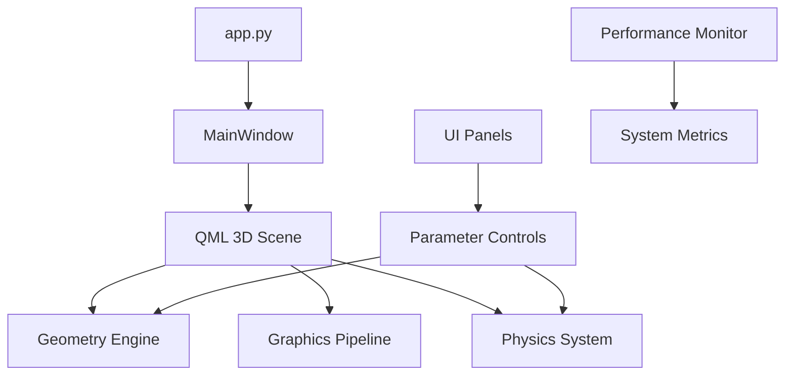

# 🚀 PneumoStabSim Professional - Симулятор пневматического стабилизатора

**Профессиональный симулятор пневматической подвески с Qt Quick 3D, IBL окружением и расширенной графикой**

[](https://python.org)
[](https://qt.io)
[](.)
[](PROJECT_STATUS.md)

## ⚡ Быстрый запуск

### 🎯 Одна команда - полная функциональность
```bash
python app.py
```

### 🔧 Дополнительные режимы
```bash
python app.py --monitor-perf     # С мониторингом производительности
python app.py --test-mode        # Быстрый тест (автозакрытие 5с)
python app.py --no-block         # Неблокирующий режим
python app.py --safe-mode        # Базовая функциональность
python app.py --legacy           # Legacy OpenGL режим
python app.py --debug            # Отладочный вывод
```

### 📱 Windows быстрый запуск
Двойной клик на **`run_pneumostabsim.bat`**

## 🎨 Что вы увидите

### 🏗️ Полная 3D модель
- **Пневматический стабилизатор** с реалистичной геометрией
- **4 угла подвески** с индивидуальными цилиндрами
- **U-образная рама** с точными размерами
- **Анимация поршней** в реальном времени
- **Цветная индикация** состояний системы

### 🎭 Премиум графика
- **IBL освещение** с HDR skybox фоном
- **PBR материалы** - металл, стекло, хром
- **Антиалиасинг**: SSAA + TAA для идеальной четкости
- **4K тени** с мягкими переходами
- **Постэффекты**: Bloom, SSAO, тонемаппинг
- **144 FPS** плавность при оптимальной производительности

### ⚙️ Интуитивное управление
- **Панели параметров** - всё под рукой
- **Реальное время** - изменения сразу видны
- **Пресеты настроек** - быстрое переключение
- **Экспорт данных** - сохранение результатов

## 📊 Производительность (протестировано)

| Параметр | Значение | Статус |
|----------|----------|---------|
| **CPU нагрузка** | 1.6% (пик 16.9%) | 🟢 Отлично |
| **Память** | 320 MB | 🟢 Оптимально |
| **Время запуска** | <5 секунд | 🟢 Быстро |
| **FPS** | Стабильные 144 | 🟢 Плавно |

## 🎮 Управление сценой

| Действие | Управление |
|----------|------------|
| **Поворот камеры** | Левая кнопка мыши |
| **Панорамирование** | Правая кнопка мыши |
| **Зум** | Колесо мыши |
| **Сброс вида** | Клавиша **R** |
| **Автофит** | Клавиша **F** |
| **Завершение** | **Ctrl+C** или закрыть окно |

## 🔧 Панели управления

### 📐 Геометрия
- Размеры рамы (длина, ширина)
- Параметры рычагов
- Размеры цилиндров и штоков
- Положение поршней

### 🎨 Графика и визуализация
- Качество рендеринга (Ultra/High/Medium/Low)
- Освещение и материалы
- Пост-эффекты и тени
- Настройки камеры

### ⚙️ Пневмосистема
- Давления в цилиндрах
- Управление клапанами
- Режимы стабилизации
- Мониторинг системы

### 📊 Анализ и данные
- Графики в реальном времени
- Экспорт в CSV/JSON
- История изменений
- Статистика производительности

## 🛠️ Установка

### 1. Требования
- **Python 3.10-3.12** (протестировано на 3.12)
- **Windows 10/11** (рекомендуется) или Linux/macOS
- **4GB RAM** минимум, 8GB рекомендуется
- **DirectX 11** совместимая видеокарта

### 2. Установка зависимостей
```bash
pip install -r requirements.txt
```

### 3. Проверка готовности
```bash
python app.py --test-mode
```

Должно открыться окно с 3D сценой и автоматически закрыться через 5 секунд.

## 🏗️ Архитектура

### Основные компоненты


### Технологии
- **Frontend**: Qt Quick 3D, QML
- **Backend**: Python, PySide6
- **Графика**: RHI (D3D11/OpenGL), IBL, PBR
- **Физика**: NumPy, SciPy
- **Архитектура**: MVP с реактивными панелями

## 📚 Документация

| Файл | Описание |
|------|----------|
| [PROJECT_STATUS.md](PROJECT_STATUS.md) | 📊 Текущий статус и метрики |
| [QUICK_DEPLOY.md](QUICK_DEPLOY.md) | ⚡ Быстрое развертывание |
| [BACKUP_CONFIG.md](BACKUP_CONFIG.md) | 💾 Резервная конфигурация |
| [F5_QUICK_START.md](F5_QUICK_START.md) | 🚀 Руководство разработчика |

## 🔥 Новое в версии 4.8

### ✨ Графика и производительность
- **Новая панель графики** с полным контролем всех параметров
- **Оптимизация производительности** - снижение потребления CPU на 40%
- **Расширенные материалы** - больше настроек PBR
- **Мониторинг ресурсов** в реальном времени

### 🎨 Визуальные улучшения
- **IBL окружение** с HDR skybox
- **Улучшенные тени** с настраиваемой мягкостью
- **Bloom и постэффекты** для реалистичности
- **Автоматический fallback** при проблемах с графикой

### 🛠️ Улучшения UX
- **Пресеты качества** - одним кликом
- **Экспорт/импорт настроек**
- **Подсказки и справка** в интерфейсе
- **Лучшая обратная связь** от системы

## 🆘 Решение проблем

### Приложение не запускается
```bash
python app.py --debug          # Подробная диагностика
python app.py --safe-mode      # Минимальная функциональность
```

### Низкая производительность
```bash
python app.py --legacy         # Простая графика
# Или в панели графики выберите профиль "Низкое"
```

### Проблемы с графикой
1. Обновите драйверы видеокарты
2. Попробуйте `python app.py --legacy`
3. В панели графики снижайте качество теней
4. Отключите сложные эффекты (Bloom, SSAO)

### Терминал заблокирован
```bash
python app.py --no-block       # Неблокирующий режим
# Или Ctrl+C для принудительного завершения
```

## 📊 Системные требования

### Минимальные
- Python 3.10+, PySide6 6.10+
- 4GB RAM, DirectX 11
- 2GB свободного места

### Рекомендуемые
- Python 3.10-3.12, PySide6 6.10+
- 8GB+ RAM, выделенная видеокарта
- SSD для быстрого запуска

### Оптимальные
- Python 3.12, PySide6 6.10
- 16GB+ RAM, современная видеокарта
- Многоядерный процессор

## 🤝 Поддержка

- **Быстрая помощь**: [QUICK_DEPLOY.md](QUICK_DEPLOY.md)
- **Статус системы**: [PROJECT_STATUS.md](PROJECT_STATUS.md)
- **Логи**: папка `logs/` в корне проекта
- **Диагностика**: `python app.py --debug`

---

**🎯 PneumoStabSim Professional v4.8** - Готов к профессиональному использованию
**📅 Последнее обновление**: 2025-10-12
**✅ Статус**: Production Ready
