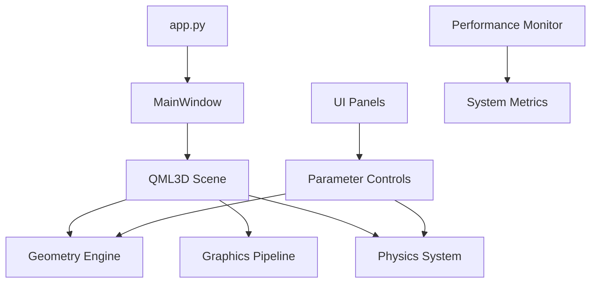

# 🚀 PneumoStabSim Professional - Симулятор пневматического стабилизатора

**Профессиональный симулятор пневматической подвески с Qt Quick3D, IBL окружением и расширенной графикой**

[](https://python.org)
[](https://qt.io)
[](.)
[](archive/2025-11/root-reports/PROJECT_STATUS.md)

## 🧭 Engineering Charter

**Наша миссия — предоставить предсказуемый, визуально безупречный симулятор с автоматизированным контролем качества.**

- **Производительность** — стабильный FPS, профилирование и мониторинг под нагрузкой входят в обязательный набор проверок.
- **Графическая достоверность** — корректное IBL, PBR-материалы и камера с естественной инерцией подтверждаются автотестами.
- **Детерминизм конфигурации** — все настройки описаны схемой, миграции отслеживаются, а изменения журналируются.
- **Автоматизация качества** — `make check`, CI-конвейеры и pre-commit-блокировки гарантируют соблюдение стандартов.
- **Документационная паритетность** — README и мастер-план всегда отражают актуальное состояние архитектуры и процессов.

## ⚡ Быстрый запуск

### 🛠️ Подготовка окружения
```sh
# Linux/macOS
uv sync --frozen --extra dev

# Windows без make
python -m tools.task_runner uv-sync
```

> `uv` устанавливает виртуальное окружение и фиксирует версии зависимостей.
> Если утилита ещё не установлена, выполните `python scripts/bootstrap_uv.py`.

### 🎯 Запуск приложения
```sh
# Внутри окружения uv
uv run python app.py

# Или напрямую (при активированной .venv)
python app.py
```

### 🔧 Дополнительные режимы
```sh
python app.py --monitor-perf      # С мониторингом производительности
python app.py --test-mode         # Без загрузки main.qml, безопасный выход (alias: --safe)
python app.py --no-block          # Неблокирующий режим
python app.py --safe-mode         # Базовая функциональность
python app.py --legacy            # Legacy OpenGL режим
python app.py --safe              # Alias для --test-mode (headless безопасный выход)
python app.py --debug             # Отладочный вывод
python app.py --env-check         # Диагностика окружения без запуска Qt
python app.py --env-report report.md  # Диагностика и сохранение отчёта
```

### 📒 Предустановки логирования

Используйте переменную окружения `PSS_LOG_PRESET`, чтобы быстро переключать уровни
логов как в Python, так и в Qt:

- `normal` — значение по умолчанию; корневой логгер пишет `INFO`, Qt подавляет
  диагностический шум.
- `debug` — включает `DEBUG` для Python и активирует сообщения `qt.quick.3d` и
  QML-подписок.
- `trace` — расширяет `debug` трассировкой `qt.quick.animations` и
  `qt.scenegraph.general`, а также включает детализированный анализ синхронизации
  (`PSS_DIAG_DETAILS=1`).

Пример для PowerShell на Windows:

```powershell
pwsh .\run_app.ps1 -LogPreset trace --% --verbose
```

Скрипты `tools/*.ps1` также принимают параметр `-LogPreset`, поэтому перед
диагностикой логов можно зафиксировать нужный профиль без ручного экспорта
переменных.

### ♻️ Режимы совместимости и ключевые флаги

#### Legacy-рендер (`--legacy`)

- Включает классический OpenGL путь Qt Quick (без RHI) и отключает Metal/D3D11.
- Используйте при проблемах с драйверами, в контейнерах с Mesa llvmpipe и для
  проверки fallback-шейдеров.
- Совместим с `--safe`, чтобы прогнать headless smoke-тест без загрузки сцены.

#### Безопасный headless (`--safe` / `--test-mode`)

- Оба флага активируют сценарий без QML-окна: приложение завершает цикл сразу
  после инициализации Qt, что повторяет поведение CI smoke-тестов.
- В режиме `--safe` автоматическое форсирование `QSG_RHI_BACKEND` отключено,
  поэтому Qt самостоятельно выбирает поддерживаемый backend (Metal, D3D11 или
  OpenGL).
- Добавьте `--env-report` для генерации отчёта о среде перед закрытием.

#### Headless Qt-платформа (`QT_QPA_PLATFORM=offscreen`)

- Значение выставляется bootstrap-скриптами автоматически в CI и при работе
  через SSH/RDP, отключая зависимость от X11/Wayland.
- Совместно с `LIBGL_ALWAYS_SOFTWARE=1` и `QT_QUICK_BACKEND=software` даёт
  гарантированный программный рендер.
- Для macOS допустим `QT_QPA_PLATFORM=minimal` + `QT_MAC_WANTS_LAYER=1`, если
  требуется Metal без окон.

### 🖥️ Headless и CI

Для сборочных агентов и интеграционных тестов используйте следующий рецепт:

```sh
export QT_QPA_PLATFORM=offscreen         # Отключает необходимость X11/Wayland
export QT_QUICK_BACKEND=software         # Программный рендеринг Qt Quick
export LIBGL_ALWAYS_SOFTWARE=1           # Гарантирует использование Mesa llvmpipe

# Дополнительно можно закрепить backend вручную, но безопасный режим сам
# пропускает форсирование QSG_RHI_BACKEND и доверяет выбор Qt
# export QSG_RHI_BACKEND=opengl

python app.py --safe                     # Идентичный сценарий smoke-тестов CI
```

> Примечание: при отсутствии переменных окружения bootstrap сам активирует
> `QT_QPA_PLATFORM=offscreen` и `PSS_FORCE_NO_QML_3D=1`, поэтому достаточно
> выставить только специфичные для вашего CI настройки (например,
> `LIBGL_ALWAYS_SOFTWARE`).

На macOS допускается `QT_QPA_PLATFORM=minimal` в сочетании с `QT_MAC_WANTS_LAYER=1`,
если требуется инициализировать Metal без полноценного окна. Полный рецепт
задокументирован в `docs/CI.md`.

### ✅ Кроссплатформенное тестирование

**После любого изменения кода** обязательно выполните полный прогон тестов на
Linux и Windows. Оба шага используют единый сценарий
`tools/cross_platform_test_prep.py`, который теперь проверяет доступность
PySide6 и `pytest-qt`, устанавлиет системные пакеты и фиксирует целевой Qt
SDK.

1. **Подготовьте зависимости.**

   - Linux/macOS:

     ```sh
     make cross-platform-prep
     ```

   - Windows и другие окружения без `make`:

     ```powershell
     python -m tools.task_runner cross-platform-prep -- --qt-version 6.10.0
     ```

   Скрипт синхронизирует `uv`-окружение, валидирует импорты `PySide6`/`pytestqt`
   и подскажет, какие системные пакеты установить вручную, если пакетный
   менеджер недоступен. Валидация импортов выполняется через интерпретатор
   `.venv`, созданный `uv`, поэтому даже при запуске команды из «системного»
   Python скрипт проверяет именно тот набор библиотек, который будет участвовать
   в тестах.

2. **Запустите тесты.**

   - Linux/macOS:

     ```sh
     make cross-platform-test
     ```

   - Windows:

     ```powershell
     python -m tools.task_runner cross-platform-test -- --pytest-args tests
     ```

   `cross_platform_test_prep` автоматически включает headless-настройки Qt
   (`QT_QPA_PLATFORM=offscreen`, `QT_QUICK_BACKEND=software` для Linux и
   `QSG_RHI_BACKEND=d3d11` для Windows), поэтому тесты с QML и Qt Quick не будут
   пропущены. При отсутствии зависимостей раннер завершит работу с ошибкой и
   подскажет повторно выполнить `python -m tools.cross_platform_test_prep --use-uv`.

3. **Повторите шаги на второй ОС.** Если Linux-прогон выполнялся в контейнере,
   задействуйте Windows-станцию или CI-агент и наоборот. Зафиксируйте вывод в
   `reports/tests/` для прослеживаемости.

> Для тонкой настройки используйте флаги `--skip-system`, `--skip-python` или
> `--pytest-args`. Полный список доступен в `python -m tools.cross_platform_test_prep --help`.

> ⚠️ Тестовый раннер завершает работу с ошибкой, если какой-либо тест был
> пропущен. Это помогает моментально выявлять проблемы с зависимостями или
> окружением на обеих платформах. Для временного обхода используйте флаг
> `--allow-skips` либо переменную `PSS_ALLOW_SKIPPED_TESTS=1`, но после
> стабилизации окружения обязательно возвращайтесь к строгому режиму.

### 🛠️ Траблшутинг по рендер-бэкендам

- **Windows / D3D11.** Проверяйте консоль на наличие `backend: D3D11`. Если Qt
  падает на ANGLE, установите `QSG_RHI_BACKEND=d3d11` или запустите в `--legacy`
  с программным OpenGL. Для удалённых сессий используйте `QT_QPA_PLATFORM=offscreen`
  + `python app.py --safe`.
- **macOS / Metal.** При пустой сцене убедитесь, что приложение запущено в GUI-
  сеансе; headless-режим требует `QT_QPA_PLATFORM=minimal` и `QT_MAC_WANTS_LAYER=1`.
  В сложных случаях переключайтесь на `--legacy` (OpenGL) для диагностики.
- **Linux / OpenGL.** Ошибки `GLX`/`EGL` решаются программным стеком:
  `QT_QPA_PLATFORM=offscreen`, `QT_QUICK_BACKEND=software`,
  `LIBGL_ALWAYS_SOFTWARE=1`. Для Wayland добавьте `QT_QPA_PLATFORM=xcb` или
  запустите `--legacy`.

#### Диагностика fallback, шейдеров и ассетов

- **Сообщения о fallback-режимах рендера.** Тестовый раннер и основное окно
  автоматически собирают shader-логи в `reports/shaders`. Прогоните
  `python tools/check_shader_logs.py reports/shaders --recursive --expect-fallback`,
  чтобы убедиться, что каждый fallback сопровождается ожидаемым логом, а также
  получить сводку по критическим и warning-сообщениям.【F:tools/check_shader_logs.py†L1-L117】
- **QML runtime warnings и fallback-настройки.** Для проверки headless-логов
  используйте `python -m tools.collect_qml_errors logs/qt_runner.log`. Скрипт
  подсвечивает строки с `qml warning`/`critical` и формирует отчёт в
  `reports/tests`, не прерывая пайплайн — предупреждения дополнительно
  попадают в аннотации PR через агрегатор.【F:tools/collect_qml_errors.py†L1-L74】【F:tools/quality/emit_pr_annotations.py†L1-L163】
- **Проблемы загрузки HDR/ассетов.** Если Qt сообщает, что ассет не найден,
  проверьте логи `normalizeHdrPath` — компонент `_hdr_paths.py` записывает
  предупреждение с перечнем проверенных путей, что помогает мгновенно увидеть,
  почему конкретный HDR не подхватился в CI или контейнере.【F:src/ui/main_window_pkg/_hdr_paths.py†L100-L119】
  На Windows все выбранные HDR автоматически сохраняются в POSIX-виде
  (`Path.resolve().as_posix()`), поэтому после сохранения настроек проверьте
  `config/app_settings.json`: в путях должны использоваться прямые слеши. Это
  гарантирует, что QML корректно подцепит ресурс без ручной правки JSON.
- **Диагностика шейдеров в UI.** При ручном прогоне обратите внимание на
  сообщения вида `⚠️ Shader warning [...]` в логере `MainWindow`, они создаются
  через `SignalsRouter` и позволяют быстро сопоставить ID эффекта с QML-виджетом
  для дальнейшей отладки.【F:src/ui/main_window_pkg/main_window_refactored.py†L327-L357】

### 🔄 Гарантии обновления пневмосистемы

После рефакторинга пневмоконтуров каждый шаг интегратора выполняет проверяемый
конвейер:

1. `src.physics.integrator.PneumoIntegrator._compute_lever_angles` переводит
   состояние кузова в углы рычагов, клипуя значения в допустимый диапазон.
2. `src.pneumo.system.PneumaticSystem.update_system_from_lever_angles`
   применяет углы ко всем цилиндрам и контролирует диагональные связи линий.
3. `src.pneumo.system.PneumaticSystem.get_line_volumes` валидирует объёмы,
   возвращая структурированные данные для каждой магистрали.
4. `src.physics.integrator.PneumoIntegrator._update_pneumatics_from_state`
   обновляет газовую сеть: каждая линия получает новый объём, проверяется на
   положительность, а затем `GasNetwork.update_pressures_due_to_volume`
   пересчитывает давление с учётом выбранного термомода.

Ошибки конфигурации (отсутствующие цилиндры, отрицательные объёмы, неверные
соединения) немедленно поднимаются как исключения, поэтому UI и CI получают
гарантию атомарного обновления — либо весь шаг успешен, либо симуляция
останавливается с диагностикой.

### ✅ Контроль качества
- **Linux/macOS:** `make check`
- **Windows без make:** `python -m tools.task_runner check`
- **Полный автономный прогон (логи в reports/quality):**
  - Linux/macOS: `make autonomous-check`
  - Windows: `python -m tools.task_runner autonomous-check`

> Все обёртки используют `tools.autonomous_check` и `tools.ci_tasks`, поэтому отчёты и артефакты идентичны независимо от платформы.

## 📘 Рекомендованные шаблоны кода

### Пример нормализации давления

Используйте `convert_pressure_value` и `PRESSURE_DROP_LIMITS`, чтобы строго
применять границы в базовых единицах и возвращать значение в интерфейсных
единицах.【F:src/ui/panels/pneumo/defaults.py†L53-L101】【F:src/ui/panels/pneumo/state_manager.py†L289-L360】

```python
from __future__ import annotations

from src.ui.panels.pneumo.defaults import (
    PRESSURE_DROP_LIMITS,
    clamp,
    convert_pressure_value,
)


def normalize_pressure_input(value: float, units: str) -> float:
    """Стабилизировать пользовательский ввод до безопасного диапазона."""

    base_value = convert_pressure_value(value, units, "Па")
    clamped_base = clamp(base_value, PRESSURE_DROP_LIMITS["min"], PRESSURE_DROP_LIMITS["max"])
    return convert_pressure_value(clamped_base, "Па", units)
```

### Пример QML-binding c защитой от обратных вызовов

Ниже показан фрагмент, повторяющий паттерн `SimulationPanel` — локальное
обновление контролов без зацикливания сигналов при синхронизации с Python.【F:assets/qml/Panels/SimulationPanel.qml†L1049-L1096】

```qml
import QtQuick 2.15
import QtQuick.Controls 2.15
import Panels.Common 1.0

SpinBox {
    id: reliefMinSpin
    from: 0
    to: 10_000_000
    stepSize: 1_000

    onValueModified: if (!root._updatingFromPython) {
        root._emitPneumaticChange("relief_min_pressure", value)
    }

    Connections {
        target: root
        function onPneumaticStatePatched(patch) {
            if (patch.relief_min_pressure !== undefined) {
                reliefMinSpin.value = patch.relief_min_pressure
            }
        }
    }
}
```

Такой подход повторяет существующую реализацию панели пневматики и упрощает
ревью — каждое изменение проходит через `_emitPneumaticChange`, а внешние
обновления пропускаются через флаг `_updatingFromPython` для защиты от циклов.

### 📱 Windows быстрый запуск
Двойной клик на **`run_pneumostabsim.bat`**

### 🔍 Проверка версии настроек
Если нужно быстро узнать актуальную версию конфигурации, используйте помощник:

```sh
python tools/show_settings_version.py
```

При необходимости можно указать альтернативный путь к файлу настроек:

```sh
python tools/show_settings_version.py --config path/to/settings.json
```

## 🎨 Что вы увидите

### 🏗️ Полная3D модель
- **Пневматический стабилизатор** с реалистичной геометрией
- **4 угла подвески** с индивидуальными цилиндрами
- **U-образная рама** с точными размерами
- **Анимация поршней** в реальном времени
- **Цветная индикация** состояний системы
- **Сферы давления ресивера** с динамическим масштабом по диагоналям

### 🎭 Премиум графика
- **IBL освещение** с HDR skybox фоном
- **PBR материалы** - металл, стекло, хром
- **Антиалиасинг**: SSAA + TAA для идеальной четкости
- **4K тени** с мягкими переходами
- **Постэффекты**: Bloom, SSAO, тонемаппинг
- **Потоки частиц** в трубопроводах с яркостью по массовому расходу
- **144 FPS** плавность при оптимальной производительности

### ⚙️ Интуитивное управление
- **Панели параметров** - всё под рукой
- **Реальное время** - изменения сразу видны
- **Пресеты настроек** - быстрое переключение
- **Экспорт данных** - сохранение результатов

### 📊 Производительность (протестировано)

| Параметр | Значение | Статус |
|----------|----------|---------|
| **CPU нагрузка** |1.6% (пик16.9%) | 🟢 Отлично |
| **Память** |320 MB | 🟢 Оптимально |
| **Время запуска** | <5 секунд | 🟢 Быстро |
| **FPS** | Стабильные144 | 🟢 Плавно |

### 🎮 Управление сценой

| Действие | Управление |
|----------|------------|
| **Поворот камеры** | Левая кнопка мыши |
| **Панорамирование** | Правая кнопка мыши |
| **Зум** | Колесо мыши |
| **Сброс вида** | Клавиша **R** |
| **Автофит** | Клавиша **F** |
| **Завершение** | **Ctrl+C** или закрыть окно |

## 🔧 Панели управления

### 📐 Геометрия
- Размеры рамы (длина, ширина)
- Параметры рычагов
- Размеры цилиндров и штоков
- Положение поршней
- Мета-параметры точности диапазонов: на каждом `RangeSlider` можно интерактивно менять `Шаг`, `Точность` (decimals) и `Ед. изм.` (units). Изменения публикуют сигналы `stepChanged`, `decimalsChanged`, `unitsChanged` и сериализуются в `current.geometry.meta.<param>` для сохранения между сессиями.

### 🎨 Графика и визуализация
- Качество рендеринга (Ultra/High/Medium/Low)
- Освещение и материалы
- Пост-эффекты и тени
- Настройки камеры

### ⚙️ Пневмосистема
- Давления в цилиндрах
- Управление клапанами
- Режимы стабилизации
- Мониторинг системы

### 📊 Анализ и данные
- Графики в реальном времени
- Экспорт в CSV/JSON
- История изменений
- Статистика производительности

## 🛠️ Установка

### 0. Подготовка окружения
1. Убедитесь, что у вас установлен Python 3.13 (поддерживаются также 3.11–3.12) и доступна утилита `make`.
2. Запустите установщик менеджера зависимостей и первичную синхронизацию: `python scripts/bootstrap_uv.py --sync`.
3. Примените зафиксированные версии зависимостей из `uv.lock`: `make uv-sync-locked`. Для обновления после изменения `pyproject.toml` используйте `uv lock`, затем повторите `make uv-sync-locked`.
4. Для запуска команд внутри окружения используйте `make uv-run CMD="python app.py --test-mode"` или любую другую команду.

Полный обзор служебных скриптов (PowerShell и Python) доступен в
[`scripts/README.md`](scripts/README.md).

> ℹ️ Скрипты `run.bat`, `run.ps1` и `setup_environment.sh` автоматически выставляют `QSG_RHI_BACKEND=opengl`. При запуске `app.py` до создания `QApplication` принудительно активируется `QQuickWindow.setGraphicsApi(QSGRendererInterface.OpenGLRhi)` и формат поверхности с глубиной 24 бит и трафаретом 8 бит, что гарантирует профиль OpenGL 3.3+ для Qt Quick 3D.

📘 Подробная пошаговая инструкция доступна в разделе [docs/ENVIRONMENT_SETUP.md](docs/ENVIRONMENT_SETUP.md)

### Установка Qt SDK (при необходимости)
- Скопируйте шаблон окружения: `cp env.sample .env` (PowerShell: `Copy-Item env.sample .env`).
- Запустите `python tools/setup_qt.py --qt-version 6.10.0 --modules qtquick3d,qtshadertools,qtimageformats` или используйте `activate_environment.*` скрипты с опцией установки Qt.
- Переменные `QT_PLUGIN_PATH` и `QML2_IMPORT_PATH` будут записаны в `.env`, что позволяет запускать `make uv-run` без дополнительной настройки.

### 1. Требования
- **Python 3.13** (протестировано на 3.13.0; Python 3.11 поддерживается в режиме совместимости)
- **Windows 10/11** (рекомендуется) или Linux/macOS
- **4GB RAM** минимум, 8GB рекомендуется
- **OpenGL 3.3+** совместимая видеокарта (backend `QSG_RHI_BACKEND=opengl`, глубина 24 бит, трафарет 8 бит)
 
### 2. Установка зависимостей
Окружение управляется `uv` и строится из `pyproject.toml` + `uv.lock`. Для локальной машины достаточно повторять:

```sh
make uv-sync-locked
```

Файлы `requirements*.txt` генерируются автоматически через `uv export` и предназначены для интеграции с инструментами, которые пока не поддерживают `uv`. Например:

```sh
uv export --format requirements.txt --output-file requirements.txt --no-dev --locked --no-emit-project
uv export --format requirements.txt --output-file requirements-dev.txt --extra dev --locked --no-emit-project
uv export --format requirements.txt --output-file requirements-compatible.txt --no-dev --locked --no-emit-project --no-annotate --no-hashes
```

Редактировать эти файлы вручную не требуется.

## 🗃️ Архив отчётов

- **Актуальные документы в корне:** `README.md`, `ROADMAP.md`, `AGENTS.MD`.
- Исторические отчёты перенесены в каталог [archive/2025-11/root-reports](archive/2025-11/root-reports/README.md), где доступен полный индекс перенесённых материалов.
- Вне индекса сохранены только целевые артефакты (`archive/assets/qml/legacy_backups`, `archive/2025-11/*`). Дубликаты и неупомянутые отчёты из `archive/reports/` и `archive/old_qml/` удалены, чтобы исключить «мертвые» ссылки.
 
### 3. Проверка готовности
```sh
 python app.py --test-mode
```
 
Должно открыться окно с3D сценой и автоматически закрыться через5 секунд.
 
## 🏗️ Архитектура
 
### Основные компоненты


### Технологии
- **Frontend**: Qt Quick3D, QML
- **Backend**: Python, PySide6
- **Графика**: RHI (D3D11/OpenGL), IBL, PBR
- **Физика**: NumPy, SciPy
- **Архитектура**: MVP с реактивными панелями

## 📚 Документация

| Файл | Описание |
|------|----------|
| [PROJECT_STATUS.md](archive/2025-11/root-reports/PROJECT_STATUS.md) | 📊 Текущий статус и метрики |
| [QUICK_DEPLOY.md](archive/2025-11/root-reports/QUICK_DEPLOY.md) | ⚡ Быстрое развертывание |
| [BACKUP_CONFIG.md](archive/2025-11/root-reports/BACKUP_CONFIG.md) | 💾 Резервная конфигурация |
| [F5_QUICK_START.md](archive/2025-11/root-reports/F5_QUICK_START.md) | 🚀 Руководство разработчика |

## 🧰 VS Code Insiders и Copilot Chat

1. **Установите [VS Code Insiders](https://code.visualstudio.com/insiders/)** – свежие сборки быстрее подхватывают обновления Qt и GitHub Copilot Chat.
2. **Откройте файл `PneumoStabSim.code-workspace`**: в нем уже прописан кроссплатформенный путь к виртуальному окружению `.venv` и fallback на системный `python3.13`/`python3.11`.
3. **Проверьте выбор интерпретатора**: команда `Python: Select Interpreter` покажет `.venv` для Windows (`.venv\Scripts\python.exe`) и Unix (`.venv/bin/python`). Если окружение еще не создано – Insiders автоматически использует `python3.13` или `python3.11`.
4. **Перезагрузите окно после изменения `.env`** – Qt переменные (например, `QSG_RHI_BACKEND` и `QT_LOGGING_RULES`) подхватываются из `.env` всеми конфигурациями запуска.
5. **Активируйте GitHub Copilot и Copilot Chat**: установите рекомендуемые расширения из всплывающего уведомления рабочей области, пройдите авторизацию GitHub и откройте вкладку *Chat* для ассистента в контексте проекта.
6. **Дополнительно**: включите `Qt QML Language Server`, Black Formatter и Mypy Checker – они добавлены в список рекомендаций и повышают качество QML/ Python-анализа в Insiders.

## 🔥 Новое в версии 5.0.0

### ✨ Архитектура и инструменты
- **Единый идентификатор релиза**: unit-тест `tests/unit/test_version_consistency.py` теперь валидирует не только README и технические руководства, но и мастер-план (`docs/RENOVATION_MASTER_PLAN.md`), закрепляя `metadata.version` как единственный источник истины.
- **CI-поток** автоматически активирует `pytest-qt`, когда зависимость установлена; минимальные контейнеры пропускают GUI-тесты благодаря защитам в `tests/conftest.py`, поэтому headless-запуски больше не падают из-за отсутствия `qtbot`.
- **`uv`** использует новые `dependency-groups`, устраняя предупреждения о `dev-dependencies` и упрощая запуск дополнительных наборов (`dev`, `docs`, `release`).
- **`tools.task_runner`** и `tools.ci_tasks` гарантируют `PYTHONIOENCODING=utf-8` и единые `QT_LOGGING_RULES`, исключая сбои кодировки в консольных логах.
- **Pre-commit** получил локальный хук `ruff-format-check-all`, который выполняет `ruff format` и `ruff check` последовательно для всего проекта.

### 🎨 Визуальные и UX обновления
- Рефакторинг панели графики завершён: координатор закреплён в `src/ui/panels/graphics/panel_graphics.py`, состояние полностью централизовано через `collect_state()`.
- Руководства в `docs/README.md` и `docs/QUICK_START.md` синхронизированы с актуальной структурой панелей и мануальных проверок.

### 🛠️ Повседневный поток
- В каталоге `tests/manual/` размещены диагностические сценарии, например `centralized_save_demo.py`, чтобы не мешать автоматическим тестам.
- Журналы теперь тестируются на поддержку Unicode, а `structlog` выводит события без экранирования символов.
- CHANGELOG фиксирует причины обновления CI (кодировки и загрузка `pytest-qt`).

## 🆘 Решение проблем

### Приложение не запускается
```bash
python app.py --debug # Подробная диагностика
python app.py --safe-mode # Минимальная функциональность
```

### Низкая производительность
```bash
python app.py --legacy # Простая графика
# Или в панели графики выберите профиль "Низкое"
```

### Проблемы с графикой
1. Обновите драйверы vídeокарты
2. Попробуйте `python app.py --legacy`
3. В панели графики снижайте качество теней
4. Отключите сложные эффекты (Bloom, SSAO)

### Терминал заблокирован
```bash
python app.py --no-block # Неблокирующий режим
# Или Ctrl+C для принудительного завершения
```

## 📊 Системные требования

### Минимальные
- Python3.13+, PySide66.10+
-4GB RAM, DirectX11
-2GB свободного места

### Рекомендуемые
- Python3.13+, PySide66.10+
-8GB+ RAM, выделенная видеокарта
- SSD для быстрого запуска

### Оптимальные
- Python3.13+, PySide66.10
-16GB+ RAM, современная видеокарта
- Многоядерный процессор

## 🤝 Поддержка

- **Быстрая помощь**: [QUICK_DEPLOY.md](archive/2025-11/root-reports/QUICK_DEPLOY.md)
- **Статус системы**: [PROJECT_STATUS.md](archive/2025-11/root-reports/PROJECT_STATUS.md)
- **Логи**: папка `logs/` в корне проекта
- **Диагностика**: `python app.py --debug`

## 📚 Публикация документации и релизов

### GitHub Pages
1. Соберите документацию локально или дождитесь артефакта `documentation-html` из шага **Build Documentation** GitHub Actions.
2. Для локальной сборки выполните:
 ```bash
 pip install .[docs]
 sphinx-build -b html docs docs/_build/html
 ```
3. Опубликуйте содержимое `docs/_build/html` в ветку, привязанную к GitHub Pages (например, `gh-pages`).

### Релиз через GitHub Releases
1. Убедитесь, что версия в `pyproject.toml` обновлена и changelog дополнен.
2. Запустите полный пайплайн CI/CD — шаг `Build Documentation` подготовит HTML-артефакт, а `Check for Forbidden Artifacts` подтвердит чистоту репозитория.
3. Создайте релиз в разделе **Releases**, приложив собранные артефакты (например, архив документации) и описание изменений.

---

**🎯 PneumoStabSim Professional v5.0.0** - Готов к профессиональному использованию
**📅 Последнее обновление**:2025-11-05
**✅ Статус**: Production Ready
