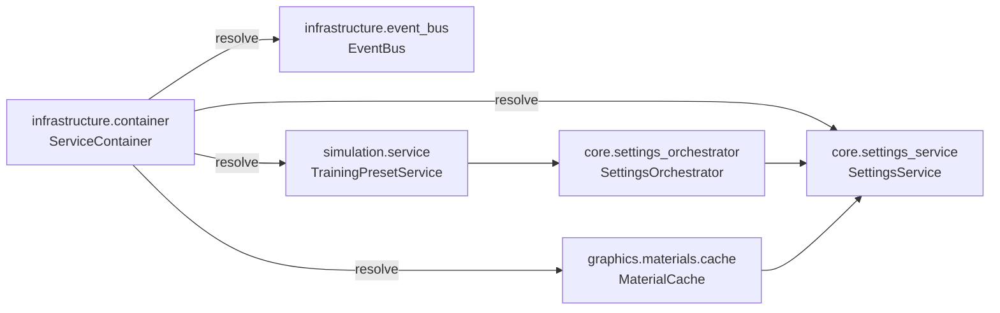

# Architecture Map

This document tracks the current high-level structure of the PneumoStabSim
Professional codebase. It is regenerated whenever the domain layout or service
wiring changes. Use `tools/architecture/derive_diagram.py` to refresh the
Mermaid diagrams and ensure the view stays in sync with the source tree.

## Domain-oriented layout

The Python sources under `src/` are organised by responsibility. Legacy
PascalCase modules now forward to their snake_case counterparts so existing
imports continue to work.

- `src/core/` – business logic, settings orchestration, and shared protocols.
- `src/infrastructure/` – runtime services such as the dependency container,
  logging, and the event bus.
- `src/graphics/` – material and rendering helpers including the
  `MaterialCache` service and baseline loaders.
- `src/simulation/` – simulation runner abstractions (training preset service
  and deterministic presets).
- `src/ui/` – Qt-facing bridges, widgets, and compatibility shims for legacy
  panels.

Compatibility shims live beside their modern equivalents (for example,
`src/ui/panels/lighting/baseline.py` re-exports the helpers from
`src/graphics/materials/baseline.py`) so downstream consumers can migrate at
their own pace without breaking imports.

## Service container wiring

All core services are registered with the process-wide
`ServiceContainer` during import. Consumers resolve dependencies using service
tokens instead of module-level singletons:

- `SETTINGS_SERVICE_TOKEN` → `SettingsService`
- `EVENT_BUS_TOKEN` → `EventBus`
- `SIMULATION_SERVICE_TOKEN` → `TrainingPresetService`
- `MATERIAL_CACHE_TOKEN` → `MaterialCache`

The container factories compose supporting collaborators automatically. For
example, the simulation service wires a fresh `SettingsOrchestrator`, and the
material cache loads the baseline manifest once and reuses it across the UI.

### Dependency graph

The Mermaid source above is generated into `docs/diagrams/architecture_map.mmd`.
Re-run the script whenever you touch service wiring so this map and the diagram
stay aligned.
