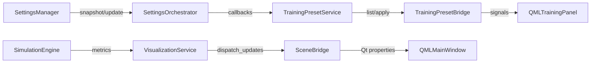

# Архитектурный обзор (обновление Phase 2)

## Целевое состояние модулей

| Слой | Основные пакеты | Ответственность |
| ---- | ---------------- | --------------- |
| Core | `src/core/interfaces.py`, `src/core/settings_orchestrator.py` | Унифицированные контракты сервисов, фасад над `SettingsManager` и Qt-ивентами |
| Simulation | `src/simulation/presets/`, `src/simulation/service.py` | Управление тренировочными пресетами, синхронизация настроек симуляции |
| UI | `src/ui/bridge/`, `src/ui/services/` | Обновление Qt-мостов и визуализации поверх сервисных интерфейсов |

Структура соответствует целевой схеме из документа
`docs/RENOVATION_PHASE_2_ARCHITECTURE_AND_SETTINGS_PLAN.md`: границы между
core, simulation и UI фиксированы сервисными протоколами.

## Сервисные интерфейсы

### SettingsOrchestrator

`src/core/settings_orchestrator.SettingsOrchestrator` реализует протокол из
`src/core/interfaces.py`. Обязанности:

* получение снимков настроек по dotted-пути;
* атомарное применение пачек обновлений с сохранением JSON-конфигурации;
* ретрансляция Qt-сигналов (`settingChanged`, `settingsBatchUpdated`) в
  callbacks Python-сервисов.

### SimulationService

`src/simulation/service.TrainingPresetService` отделяет работу с пресетами от
Qt-слоя:

1. При старте запрашивает `SettingsOrchestrator` и вычисляет активный пресет.
2. Применяет пресеты через фасад (без прямого доступа к `SettingsManager`).
3. Публикует смену активного пресета подписчикам (UI-мосты, тесты).

### VisualizationService

`src/ui/services/visualization_service.VisualizationService` агрегирует
состояния сцен, камеры и рендеринга. Сервис:

* нормализует входящие словари от симуляции;
* збагачивает данные камеры орбитальными пресетами и HUD-телеметрией;
* хранит последнее состояние и предоставляет к нему read-only доступ.

## Потоки данных

* Применение пресета (`applyPreset` в QML) вызывает метод в `TrainingPresetBridge`,
  который делегирует операцию сервису. Сервис обновляет настройки через
  оркестратор, что гарантирует генерацию Qt-сигналов и запись на диск.
* Смена любой настройки (в том числе пользователем) приводит к событию в
  оркестраторе. `TrainingPresetService` пересчитывает активный пресет и
  уведомляет мост о дрейфе.
* Мост визуализации (`SceneBridge`) не содержит бизнес-логики: он просто
  ретранслирует данные из `VisualizationService` в свойства Qt и обеспечивает
  синхронное обновление слушателей.

## Изменения диаграмм

* Контракты сервисов перенесены в `src/core/interfaces.py` (единая точка
  расширения).
* На уровне UI добавлен слой `src/ui/services/`, на схемах он расположен между
  `runtime` и QML.
* Настройки и пресеты теперь взаимодействуют только через `SettingsOrchestrator`
  и `TrainingPresetService`, что исключает прямые зависимости между QML-мостами
  и `SettingsManager`.

## Синхронизация с мастер-планом

Обновление соответствует пунктам Phase 2:

* **Module Restructuring** – выделены сервисные пакеты и интерфейсы.
* **Dependency Injection & Services** – оркестратор и сервисы применяют
  типизированные контракты и допускают подмену в тестах.
* **Signal/Slot Alignment** – все оповещения проходят через Qt-ивенты оркестратора,
  что упрощает трассировку цепочек сигналов, описанных в мастер-плане.

