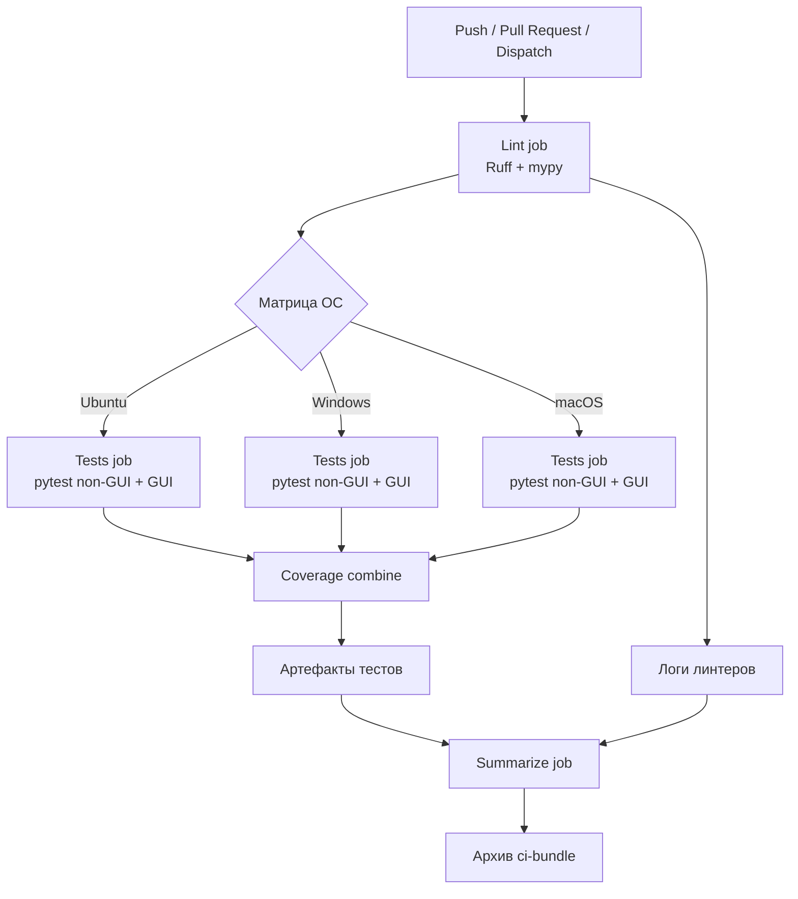

# Стратегия CI/CD PneumoStabSim Professional

Новая система непрерывной интеграции объединяет линтеры, типизацию, тесты Python/QML и сбор артефактов в единый конвейер GitHub Actions. Настройка ориентирована на кроссплатформенную проверку (Windows, macOS, Linux) и повторяется локальными инструментами (`pre-commit`, задачи VS/VS Code).

## Обзор workflow `ci.yml`

| Джоб | Описание | Ключевые технологии |
| --- | --- | --- |
| `lint` | Устанавливает dev-зависимости, выполняет `ruff check`, `ruff format --check`, `mypy` и сохраняет логи. | Python3.13, Ruff, mypy |
| `tests` | Запускается в матрице ОС (Ubuntu, Windows, macOS). Устанавливает Qt6.6, прогоняет `pytest -m "not gui"`, QML/GUI тесты, объединяет покрытие и выгружает отчёты. | pytest, pytest-qt, PySide6, coverage |
| `summarize` | Собирает все артефакты из матрицы и публикует единый архив `ci-bundle`. | actions/download-artifact |

### Блок-схема пайплайна

### Триггеры
- `push` и `pull_request` для веток `master`, `develop`.
- `workflow_dispatch` для ручного запуска.

## Кеширование и артефакты
- **Pip**: `actions/setup-python@v5` с `cache: 'pip'` + fallback-кеш для `~/.cache/pip` на Linux.
- **Qt**: `jurplel/install-qt-action@v4` с встроенным кешем модулей (`qtquick3d`, `qtshadertools`, `qtimageformats`).
- **Тестовые артефакты**: лог pytest, JUnit XML, coverage XML/HTML сохраняются в `artifacts/test` и выгружаются как `test-results-${{ matrix.os }}`.
- **Логи линтеров**: шаг `lint` складывает отчёты в `artifacts/lint` и всегда публикует их.
- **Финальный архив**: job `summarize` подтягивает все артефакты и публикует сводный `ci-bundle`.

## Паритет локальных инструментов
- `pre-commit` теперь использует Ruff (lint + формат), mypy и предоставляет ручные хуки `pytest-core` и `pytest-gui`, повторяющие команды CI.
- `.vscode/tasks.json` добавляет задачи `🛠️ CI: подготовка окружения`, `🔍 Ruff lint (CI)`, `🎨 Ruff format --check`, `📊 Pytest (core, coverage)`, `🧭 Pytest (QML/GUI)`.
- `.vs/launch.vs.json` содержит конфигурации запуска для Ruff, mypy и обоих pytest-прогонов.
- `PneumoStabSim.code-workspace` включает настройки pytest (`-m "not gui"`) и авто-запуск Ruff при сохранении.

## SLA по красным сборкам
| Сценарий | Действие | Владелец | Максимальное время |
| --- | --- | --- | --- |
| Любая сборка в статусе `failure` | Анализ логов, определение ответственного | Автор коммита / дежурный | ≤2 часа с момента уведомления |
| Подтверждённый дефект CI (инфраструктура) | Горячий фикс или откат | Дежурный по инфраструктуре | ≤4 часа |
| Функциональный дефект в коде | Исправление, пуш в ветку, повторный прогон CI | Автор изменения | ≤24 часа |

Если SLA нарушается, фиксируется инцидент в трекере и назначается ретроспектива на ближайший синк.

## Защита веток
Чтобы предотвратить нестабильные изменения от попадания в основные ветки, в GitHub настроены защищённые ветки с обязательными статус-чеками.

### Основные правила
- Включена защита веток `master` и `develop`.
- Минимум один одобряющий ревью обязателен перед слиянием.
- Ветку нельзя смержить, пока не пройдут все обязательные статус-чеки (`make verify` и дополнительные проверки из GitHub Actions).
- Требуется обновление ветки перед слиянием, если в целевую ветку были добавлены новые коммиты.
- Правила распространяются на администраторов репозитория.

### Обязательные статус-чеки
- **CI: make verify** — агрегирует линтеры и тесты (flake8, black, mypy, pytest).
- **Codecov** — отслеживание покрытия тестами (при наличии).
- Дополнительные рабочие процессы могут быть добавлены, но их прохождение обязательно для слияния.

### Работа с защищёнными ветками
- Используйте pull request'ы для всех изменений в `master` и `develop`.
- Синхронизируйте ветку фича-branch с целевой веткой перед запросом ревью, чтобы избежать блокировок из-за устаревших коммитов.
- Следите за статусом проверок в интерфейсе GitHub и дублируйте информацию в описании PR.

## Практические подсказки
- Перед пушем запускайте `pre-commit run --all-files` и при необходимости `pre-commit run pytest-core --hook-stage manual`.
- Для QML тестов в локальном окружении установите переменные `QT_QPA_PLATFORM=offscreen`, `QT_QUICK_BACKEND=software` (аналогично настройкам CI).
- Покрытие объединяется командой `python -m coverage combine && python -m coverage html` (см. задачи VS/VS Code).

## История изменений
- **2025-10-22** — переход на `ci.yml`, добавление кэширования, унификация локальных инструментов, введение SLA для красных сборок.
